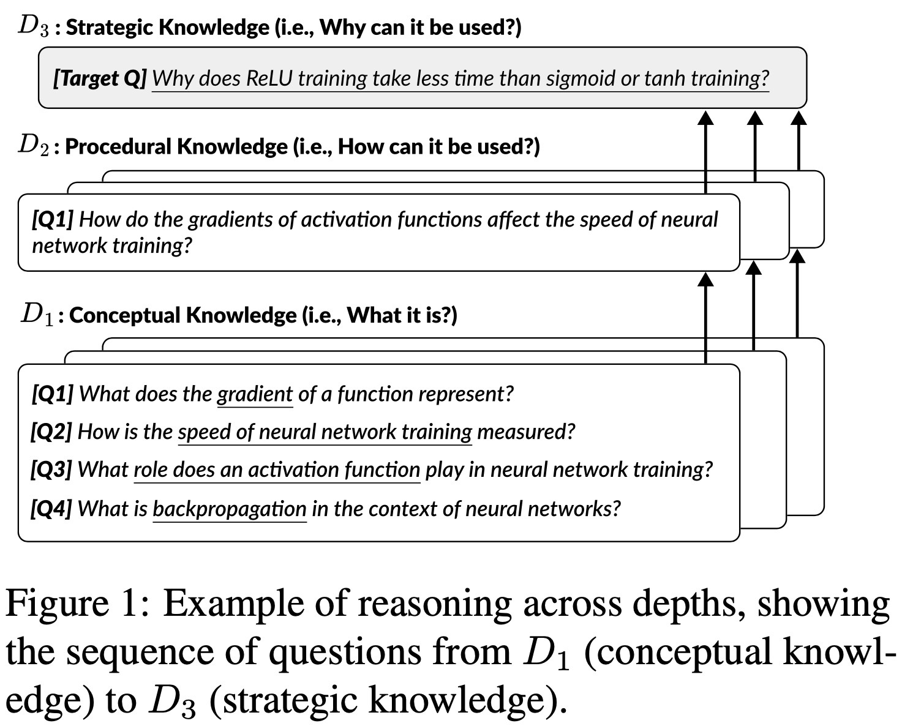
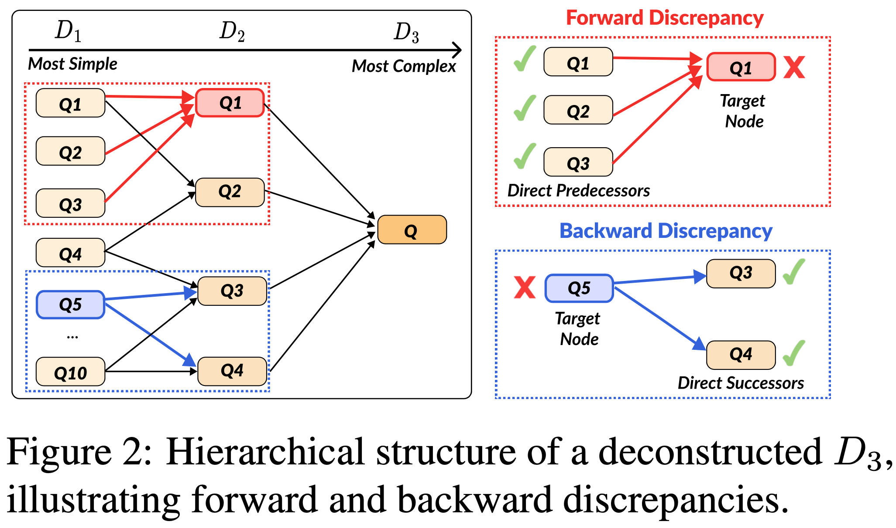

# Hierarchical Deconstruction of LLM Reasoning: A Graph-Based Framework for Analyzing Knowledge Utilization

This repository is the official implementation of [Hierarchical Deconstruction of LLM Reasoning: A Graph-Based Framework for Analyzing Knowledge Utilization](https://aclanthology.org/2024.emnlp-main.288/). 

- [📃 Paper](https://aclanthology.org/2024.emnlp-main.288/)
- [🧵 Brief overview of paper (X thread)](https://x.com/miyoung_ko/status/1807753375196270716)
- [🤗 Dataset (DepthQA)](https://huggingface.co/datasets/kaist-ai/DepthQA)

## TL;DR
We investigate how large language models utilize knowledge for reasoning to solve complex questions, based on a method that deconstructs complex questions into a hierarchical graph.

Each depth of knowledge required to answer the question represents different levels of complexity. | Some reasoning is required to answer a more complex question compared to a simpler question.
---- | ----
 | 


## Requirements

Create a virtual environment with python>=3.9 and install the appropriate PyTorch version for your machine.

In our project, we use a node of 4 x NVIDIA A6000 40GB GPUs with CUDA version 12.3.

```bash
conda create -n myenv python=3.10
conda activate myenv
conda install pytorch pytorch-cuda=12.1 -c pytorch -c nvidia
```

To install requirements:

```setup
pip install -r requirements.txt
```

## Inference

You can experiment multiple inference modes with our dataset, [DepthQA]((https://huggingface.co/datasets/kaist-ai/DepthQA)):

- Single-turn:
  - `zero-shot`: Only the target question is in the input.
  - `prompt-gold`: Before the target question, shallower (i.e., predecessors to the target question) question and gold answer pairs are provided as context.
  - `prompt-pred`: Before the target question, shallower question and its own predicted answer pairs are provided as context.
- `multi-turn`: Shallower questions are provided as inputs in a multi-turn conversation, i.e., the model answers each shallower question one by one and then is presented with the target question.

Most HuggingFace `AutoModelForCausalLM` models can be run with [src/inference/single_turn.py](src/inference/single_turn.py) and [src/inference/multi_turn.py](src/inference/multi_turn.py), with vLLM integrated and using mixed precision.

For OpenAI models, use [src/inference/single_turn_openai.py](src/inference/single_turn_openai.py) and [src/inference/multi_turn_openai.py](src/inference/multi_turn_openai.py).

### Example usage

To inference LLaMA 3 8B Instruct with all modes:
```bash
bash scripts/inference/llama3_8b.sh
```

To inference GPT-3.5 Turbo with all modes:
```bash
bash scripts/inference/gpt-3.5-turbo.sh
```

## Evaluation

Following the LLM-as-a-Judge approach, we use `gpt-4-0125-preview` to score the correctness of model predictions. Specifically, we use the [Batch API](https://platform.openai.com/docs/guides/batch) for faster and cheaper evaluation. Our implementation of the evaluation pipeline consists of four steps:

1. Creating a batch request
2. Check the status of the batch request
3. Retrieve the results of the batch request
4. Calculate evaluation metrics
    - Average accuracy
    - Forward discrepancy
    - Backward discrepancy

where the first three steps are performed in [src/evaluation/batch_eval_openai.py](src/evaluation/batch_eval_openai.py) and the last step is in [src/evaluation/metric_calculator.py](src/evaluation/metric_calculator.py)

### Example usage

To analyze each step in the evaluation pipeline of LLaMA 3 8B Instruct `zero-shot` predictions, refer to the example commands and printed outputs in [scripts/evaluation/llama3_8b_zero-shot.sh](scripts/evaluation/llama3_8b_zero-shot.sh).

To run the entire pipeline of LLaMA 3 8B Instruct `prompt-gold` predictions automatically:
```bash
bash scripts/evaluation/llama3_8b_prompt-gold_auto.sh
```


## Citation
```bibtex
@inproceedings{ko-etal-2024-hierarchical,
    title = "Hierarchical Deconstruction of {LLM} Reasoning: A Graph-Based Framework for Analyzing Knowledge Utilization",
    author = "Ko, Miyoung  and
      Park, Sue Hyun  and
      Park, Joonsuk  and
      Seo, Minjoon",
    editor = "Al-Onaizan, Yaser  and
      Bansal, Mohit  and
      Chen, Yun-Nung",
    booktitle = "Proceedings of the 2024 Conference on Empirical Methods in Natural Language Processing",
    month = nov,
    year = "2024",
    address = "Miami, Florida, USA",
    publisher = "Association for Computational Linguistics",
    url = "https://aclanthology.org/2024.emnlp-main.288",
    doi = "10.18653/v1/2024.emnlp-main.288",
    pages = "4995--5027",
    abstract = "Despite the advances in large language models (LLMs), how they use their knowledge for reasoning is not yet well understood.In this study, we propose a method that deconstructs complex real-world questions into a graph, representing each question as a node with predecessors of background knowledge needed to solve the question. We develop the DepthQA dataset, deconstructing questions into three depths: (i) recalling conceptual knowledge, (ii) applying procedural knowledge, and (iii) analyzing strategic knowledge. Based on a hierarchical graph, we quantify forward discrepancy, a discrepancy in LLM performance on simpler sub-problems versus complex questions. We also measure backward discrepancy where LLMs answer complex questions but struggle with simpler ones. Our analysis shows that smaller models exhibit more discrepancies than larger models. Distinct patterns of discrepancies are observed across model capacity and possibility of training data memorization. Additionally, guiding models from simpler to complex questions through multi-turn interactions improves performance across model sizes, highlighting the importance of structured intermediate steps in knowledge reasoning. This work enhances our understanding of LLM reasoning and suggests ways to improve their problem-solving abilities.",
}

```
